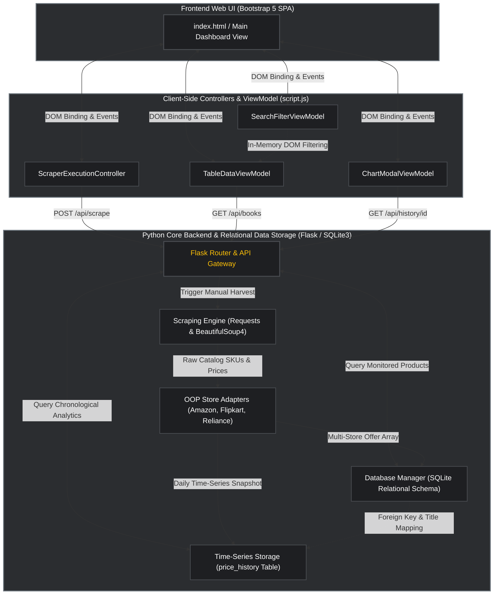

# 🏢 Enterprise Competitor Price Tracker - System Architecture

---

## 📋 Architectural Overview (For PowerPoint Slide Text)
* **Tier 1 (Frontend UI)**: Represents our Single-Page Application (SPA) view rendered via `index.html`. It communicates with underlying controllers through standard event delegation and responsive DOM property bindings.
* **Tier 2 (Client-Side Logic / ViewModels)**: Organizes our frontend functionality into modular controllers (`ScraperExecutionController`, `TableDataViewModel`, `SearchFilterViewModel`, and `ChartModalViewModel`). These manage user inputs and communicate asynchronously with the backend server without requiring page reloads.
* **Tier 3 (Python Core Backend & Storage)**: The engine room of the software. An HTTP request intercepted by the `Flask Router & API Gateway` is routed to the `Scraping Engine` for network harvesting or straight to the `Database Manager` and `Time-Series Storage` layers to serve low-latency analytics payloads back to the dashboard!
